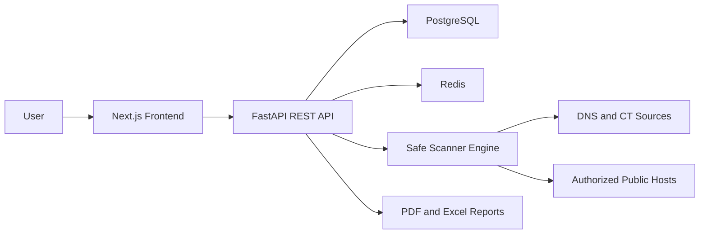

# SurfaceWatch

SurfaceWatch is an authorized attack surface monitoring platform that helps organizations track public-facing assets, detect risky configuration changes, identify missing web security controls, monitor certificate health, run deeper website exposure checks, and generate professional security reports.

It is designed for small companies, cybersecurity interns, and portfolio use. Default scans are conservative and passive-first. Explicit aggressive scans broaden coverage for authorized scopes while still avoiding exploitation, brute force, credential attacks, and destructive testing.

## Features

- FastAPI backend with JWT authentication, password hashing, project CRUD, ownership checks, and domain safety validation.
- PostgreSQL schema for users, projects, assets, scans, logs, findings, ports, SSL/TLS, security headers, technologies, changes, reports, notifications, and scheduled monitoring.
- Scanner modules for passive seed discovery, DNS resolution, HTTP probing, SSL checks, header analysis, safe/aggressive TCP port profiles, technology fingerprinting, web exposure checks, risk scoring, and change descriptions.
- Next.js dashboard with dark cybersecurity SaaS styling, risk metrics, charts, findings, assets, scans, reports, notifications, and ethical-use messaging.
- Demo seed data so the dashboard looks useful before scanning real authorized assets.
- Docker Compose for PostgreSQL, Redis, backend, and frontend.

## Screenshots

Add screenshots from the local demo dashboard after running the app.

## Architecture



## Quick Start

The fastest local demo uses the backend's default SQLite database. Run these commands from the project root in PowerShell.

### 1. Start The Backend

```powershell
cd C:\Users\Home\Desktop\SurfaceWatch\backend
python -m venv .venv
.\.venv\Scripts\Activate.ps1
python -m pip install --upgrade pip
pip install -r requirements.txt
alembic upgrade head
python -m app.bootstrap
uvicorn app.main:app --reload --host 127.0.0.1 --port 8000
```

Keep this terminal open. The API will be available at:

- API base URL: `http://127.0.0.1:8000/api/v1`
- API docs: `http://127.0.0.1:8000/docs`

### 2. Start The Frontend

Open a second PowerShell terminal and run:

```powershell
cd C:\Users\Home\Desktop\SurfaceWatch\frontend
npm install
npm run dev
```

Open the app at `http://localhost:3000`.

Demo login:

- Email: `demo@surfacewatch.dev`
- Password: `SurfaceWatchDemo123!`

### 3. Register A New User

Use the app UI at `http://localhost:3000/register`, or call the API directly:

```powershell
Invoke-RestMethod `
  -Method Post `
  -Uri http://127.0.0.1:8000/api/v1/auth/register `
  -ContentType "application/json" `
  -Body '{"email":"you@example.com","password":"ChangeMe123!","full_name":"Your Name"}'
```

Then log in at `http://localhost:3000/login`.

## Docker Compose Setup

Use this path when you want PostgreSQL and Redis running in containers.

```powershell
cd C:\Users\Home\Desktop\SurfaceWatch
Copy-Item .env.example .env
docker compose up --build
```

In another terminal, seed demo data inside the backend container:

```powershell
cd C:\Users\Home\Desktop\SurfaceWatch
docker compose exec backend python -m app.bootstrap
```

Open:

- Frontend: `http://localhost:3000`
- API docs: `http://localhost:8000/docs`

Stop Docker services with:

```powershell
docker compose down
```

## Local Commands

Run backend tests:

```powershell
cd C:\Users\Home\Desktop\SurfaceWatch\backend
.\.venv\Scripts\Activate.ps1
pytest
```

Build the frontend:

```powershell
cd C:\Users\Home\Desktop\SurfaceWatch\frontend
npm run build
```

Stop any local dev servers using ports `3000` or `8000`:

```powershell
$ports = Get-NetTCPConnection -LocalPort 3000,8000 -State Listen -ErrorAction SilentlyContinue
$ports | ForEach-Object { Stop-Process -Id $_.OwningProcess -Force }
```

## CLI

```bash
cd backend
python -m app.cli scan example.com
python -m app.cli ssl example.com
python -m app.cli ports example.com --ports 80,443,8080
```

Only run these commands against domains you own or are authorized to assess.

## Safety And Authorization Policy

SurfaceWatch must only be used for assets owned by the user or covered by explicit authorization. Default checks are passive-first, low concurrency, time-limited, and non-exploitative. Aggressive checks must be explicitly selected for an authorized project and add broader port coverage plus safe HTTP probes for common public exposure mistakes such as exposed environment files, VCS metadata, backup archives, database dumps, directory listings, diagnostic pages, and server-status pages. Internal and localhost targets are blocked by default unless `ALLOW_INTERNAL_TARGETS=true` is set for development.

## Skills Demonstrated

- External attack surface management
- DNS and subdomain discovery
- SSL/TLS analysis
- HTTP security header assessment
- Safe port scanning
- Technology fingerprinting
- Risk scoring
- Change detection
- Background job architecture
- Report generation architecture
- Full-stack cybersecurity dashboard development

## Current Phase

SurfaceWatch now includes API-backed auth, project management, safe manual scans, assets/findings/scans, scan logs, change timelines, notifications, PDF/Excel reports, finding notes, scheduled job records, audit logs, auth throttling, and scan cancel/retry controls. Remaining work is mostly production hardening: persistent distributed queues, email/webhook delivery, richer team administration, more scanner source integrations, and broader automated tests.
