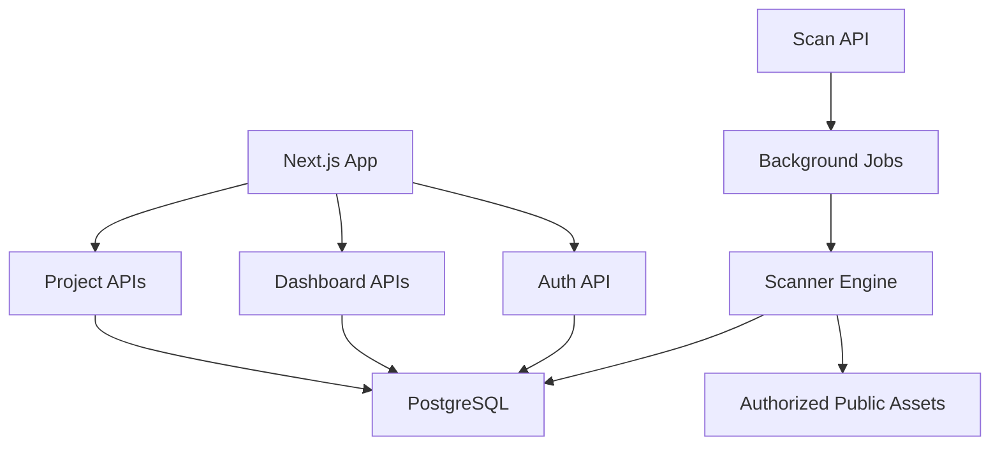

# Architecture

SurfaceWatch is split into a Next.js frontend, FastAPI backend, PostgreSQL database, Redis queue/cache layer, and scanner modules.

The backend owns authorization, persistence, validation, scan orchestration, risk scoring, change detection, report generation, and notification creation. The frontend focuses on workflow, filtering, visualization, and clear safety messaging.
