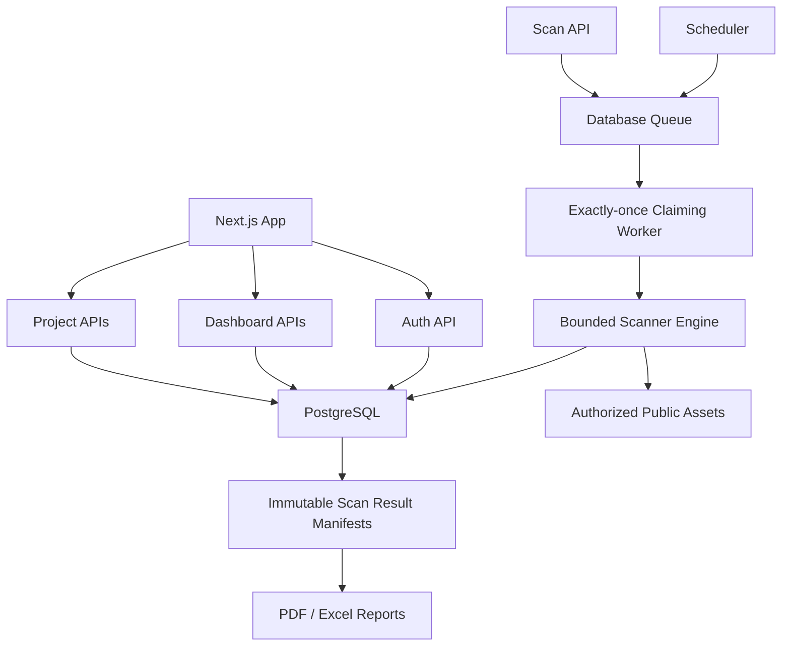

# Architecture

SurfaceWatch is split into a Next.js frontend, FastAPI backend, PostgreSQL persistence and database-backed scan queue, dedicated worker and scheduler processes, and scanner modules. Docker also provisions Redis for cache-ready extensions; scan ownership and recovery currently use PostgreSQL row locks, leases, and heartbeats.

The backend owns authorization, persistence, validation, atomic job claiming, scan orchestration, coverage accounting, risk scoring, change detection, report generation, and notification creation. Scanner stages run network work concurrently but serialize database persistence. Current-state asset and finding rows support lifecycle workflows; immutable per-scan manifests preserve every historical observation and failure. The frontend exposes both current project state and scan-specific evidence without mixing them.
